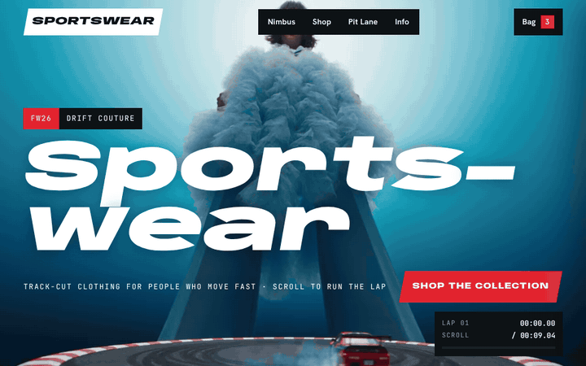
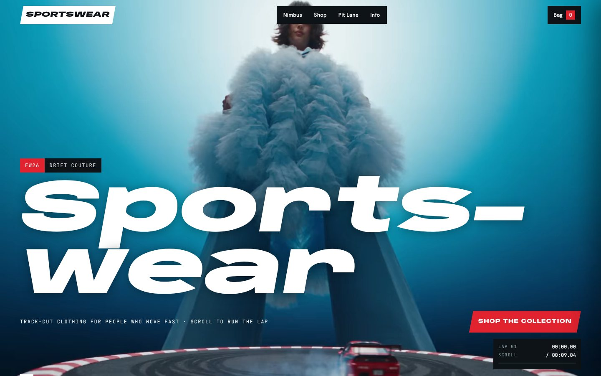
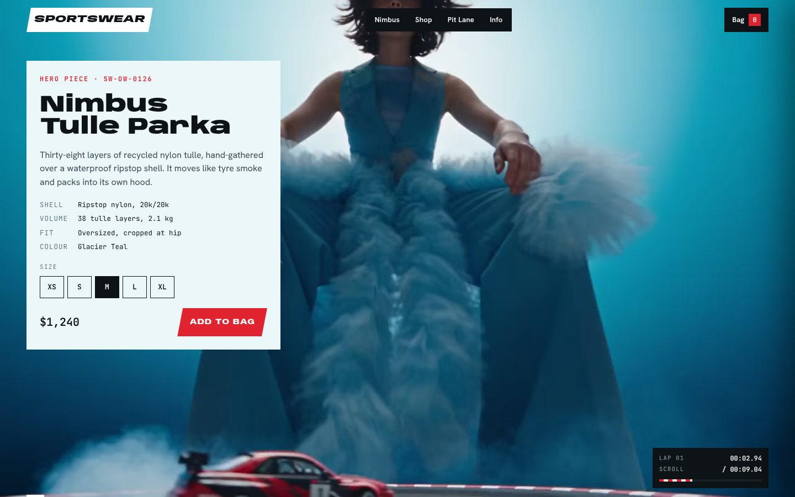
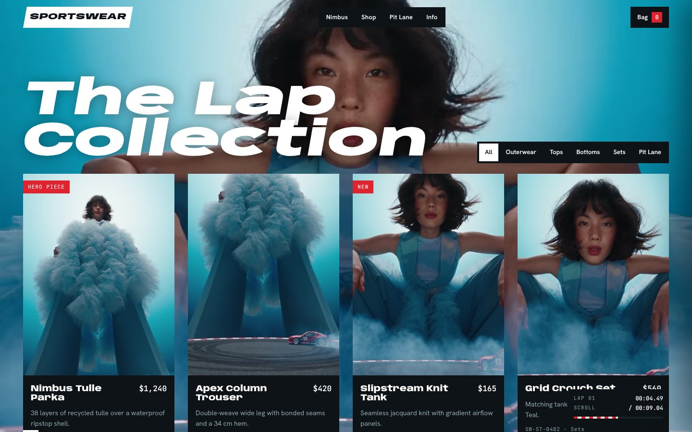
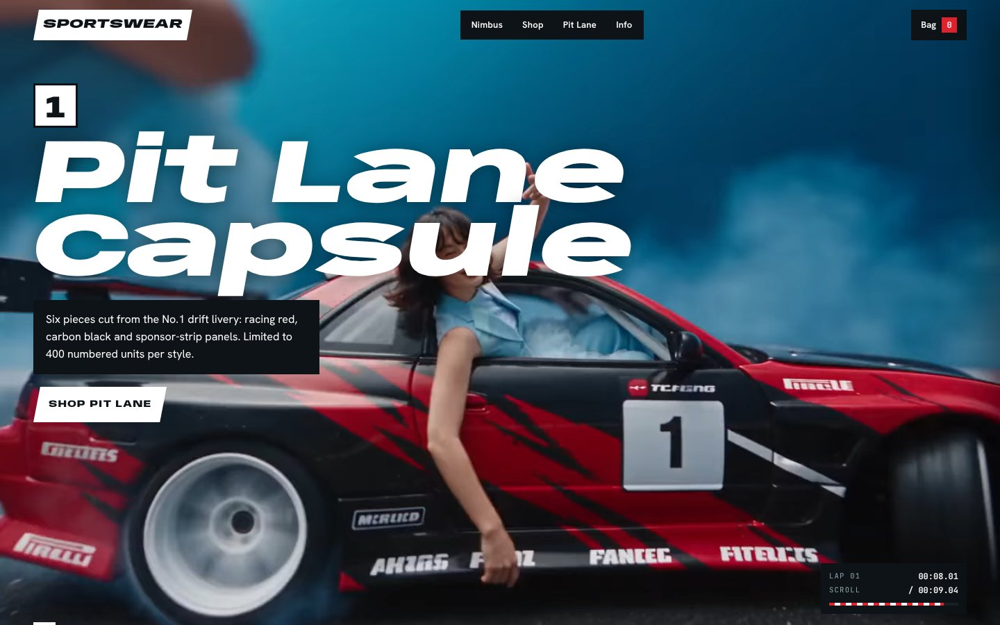
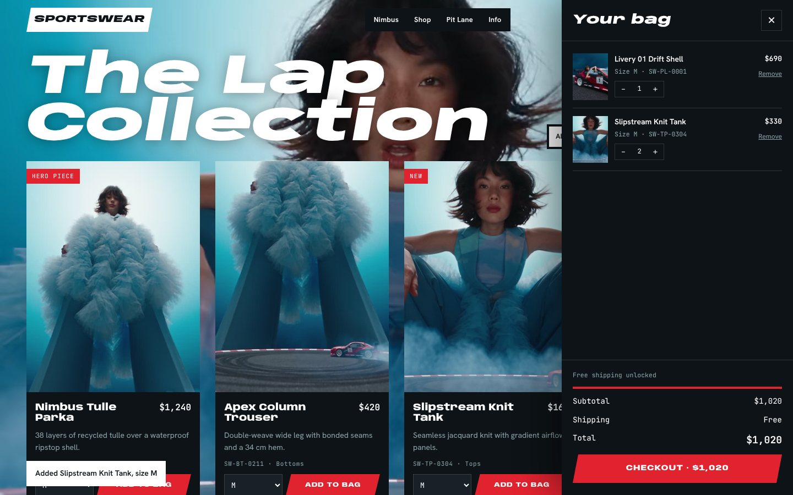
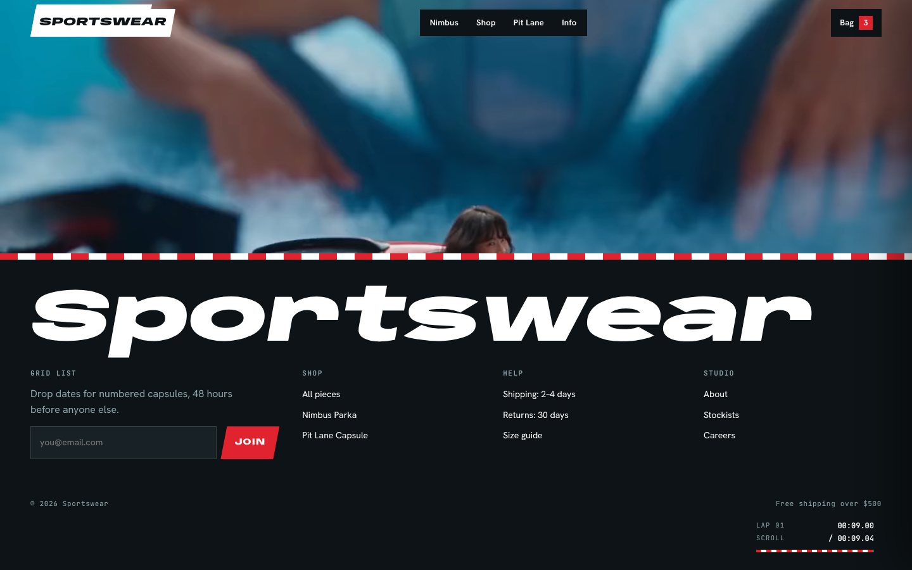
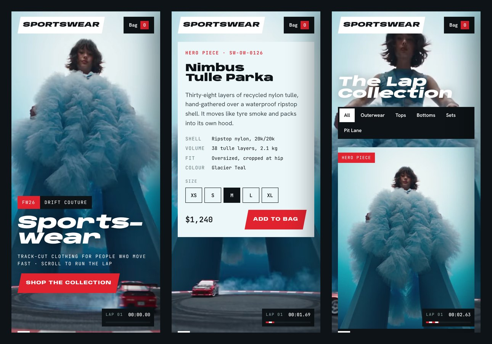
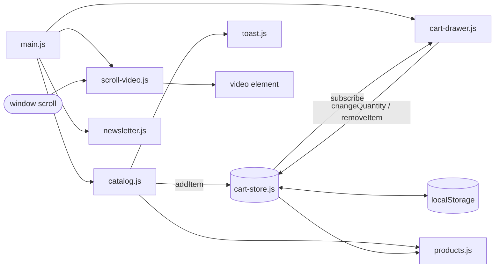

<div align="center">

# SPORTSWEAR

### FW26 · Drift Couture Storefront

**Track-cut clothing for people who move fast.**<br>
An e-commerce storefront where the campaign film is the website: the video runs behind every section at full opacity and is scrubbed frame by frame by your scroll.


<br>



<sub>Scroll position drives the film's timeline. The lap timer in the corner shows the exact frame.</sub>

</div>

---

## Contents

- [Overview](#overview)
- [Screenshots](#screenshots)
- [Features](#features)
- [How the scroll video works](#how-the-scroll-video-works)
- [Tech stack](#tech-stack)
- [Getting started](#getting-started)
- [Deployment](#deployment)
- [Project structure](#project-structure)
- [Architecture](#architecture)
- [Customisation](#customisation)
- [Replacing the film](#replacing-the-film)
- [Accessibility](#accessibility)
- [Browser support](#browser-support)
- [Roadmap](#roadmap)
- [Contributing](#contributing)
- [License](#license)

---

## Overview

Sportswear's FW26 collection, **Drift Couture**, was shot as one continuous film: a giant model in a tulle cloud, tyre smoke and a No.1 drift car on a turntable. The storefront is built around that footage.

- The film is **fixed behind the whole page** and is never dimmed, tinted or covered by an overlay.
- **Scrolling moves the film.** The top of the page is the first frame, the footer is the last, and scrolling back up plays it in reverse.
- Content sits on solid "pit board" panels, so text stays readable without darkening the video.
- The visual identity takes its cues from the shoot: teal studio light, the car's racing red, asphalt black and red-and-white kerb stripes.

---

## Screenshots

<table>
  <tr>
    <td width="50%">
      
      <p align="center"><b>Hero</b><br><sub>Wordmark over the film's opening frame</sub></p>
    </td>
    <td width="50%">
      
      <p align="center"><b>Featured product</b><br><sub>Specs, size selector and add to bag</sub></p>
    </td>
  </tr>
  <tr>
    <td width="50%">
      
      <p align="center"><b>The Lap Collection</b><br><sub>Category filters and quick add</sub></p>
    </td>
    <td width="50%">
      
      <p align="center"><b>Pit Lane Capsule</b><br><sub>Timed to the drift-car scene</sub></p>
    </td>
  </tr>
  <tr>
    <td width="50%">
      
      <p align="center"><b>Bag drawer</b><br><sub>Quantities, shipping meter and totals</sub></p>
    </td>
    <td width="50%">
      
      <p align="center"><b>Footer</b><br><sub>Newsletter sign-up and links</sub></p>
    </td>
  </tr>
</table>

### Mobile

<p align="center">
  
</p>

---

## Features

| Area | What it does |
| --- | --- |
| **Scroll-driven film** | Maps scroll progress to video time with smoothed `requestAnimationFrame` seeking. Instant in both directions. |
| **Full-opacity video** | No overlay, gradient or tint. Readability comes from solid content panels. |
| **Product catalogue** | Six products, six category filters and a size picker on every card. |
| **Featured product** | Spec sheet, size selector and add to bag for the hero piece. |
| **Bag drawer** | Line items, quantity controls, remove, a free-shipping meter and live totals. |
| **Persistent bag** | The bag is saved in `localStorage` and restored on the next visit. |
| **Lap timer** | A HUD showing the current film time and progress as a kerb-stripe bar. |
| **Newsletter** | Validated form with a single function to connect your email provider. |
| **Responsive** | Tested from 360 px phones to 1440 px+ desktops, with no horizontal scroll. |
| **Accessible** | Skip link, visible focus, an ARIA dialog for the bag, labelled controls, reduced-motion support. |
| **Zero dependencies** | Plain HTML, CSS and JavaScript ES modules. No framework and no build step. |

---

## How the scroll video works

Scroll-scrubbed video usually stutters because browsers can only seek cleanly to **keyframes**. This project removes that problem at three levels:

1. **All-intra encoding.** Every frame is a keyframe (`-g 1`), so any timestamp decodes instantly.
2. **Loaded into memory.** The file is fetched once with progress reporting and played from a `blob:` URL, so seeking never waits on the network.
3. **Smoothed seeking.** Each animation frame eases `currentTime` toward the scroll target and skips the update while a seek is still in progress, so seeks never queue up.

```js
// js/modules/scroll-video.js (simplified)
const target = scrollProgress() * (duration - END_PADDING);
current += (target - current) * SMOOTHING;

if (!video.seeking && Math.abs(video.currentTime - current) > MIN_SEEK_DELTA) {
  video.currentTime = current;
}
```

Two encodes ship together: **H.264 MP4** (primary) and **VP9 WebM** (fallback for browsers without H.264). The right one is picked with `canPlayType()`.

How much film each section gets is set by its vertical padding in `css/sections.css`. More padding means that section stays on screen for more of the film.

---

## Tech stack

| Layer | Choice |
| --- | --- |
| Markup | Semantic HTML5 |
| Styling | Modern CSS: custom properties, grid, `clamp()`, `svh` units, variable fonts |
| Scripting | Vanilla JavaScript, native ES modules |
| Typography | [Anybody](https://fonts.google.com/specimen/Anybody) (display, variable width), [Hanken Grotesk](https://fonts.google.com/specimen/Hanken+Grotesk) (body), [JetBrains Mono](https://fonts.google.com/specimen/JetBrains+Mono) (data) |
| Video | FFmpeg: all-intra H.264 and VP9 |
| Hosting | GitHub Pages through GitHub Actions |

---

## Getting started

### Prerequisites

- Any modern browser
- A static file server. Node.js 18+ or Python 3 both work.

### Run locally

```bash
git clone https://github.com/<your-username>/sportswear-site.git
cd sportswear-site

# Option A: Node
npm start            # serves on http://localhost:8080

# Option B: Python
python3 -m http.server 8080
```

Open **http://localhost:8080** and scroll.

> [!NOTE]
> Opening `index.html` by double-clicking won't work. Browsers block ES modules and `fetch()` on `file://` URLs, so always use a local server.

---

## Deployment

### GitHub Pages (included)

1. Push the repository to GitHub.
2. Open **Settings → Pages** and set **Source** to **GitHub Actions**.
3. Every push to `main` runs [`.github/workflows/pages.yml`](.github/workflows/pages.yml) and publishes the site.

Your site will be live at `https://<your-username>.github.io/sportswear-site/`.

### Other hosts

The project is fully static, so it also deploys to Netlify, Vercel, Cloudflare Pages or any CDN with no configuration. Set the publish directory to the repository root.

---

## Project structure

```
sportswear-site/
├── index.html                    # Page structure, SEO and Open Graph meta
├── css/
│   ├── tokens.css                # Design tokens: colour, type, spacing, z-index
│   ├── base.css                  # Reset, document defaults, utilities
│   ├── components.css            # Buttons, nav, cards, drawer, lap timer, toast
│   └── sections.css              # Hero → statement → feature → shop → pit lane → footer
├── js/
│   ├── main.js                   # Entry point: starts each module
│   ├── data/
│   │   └── products.js           # Product catalogue (typed with JSDoc)
│   └── modules/
│       ├── scroll-video.js       # Scroll → film time
│       ├── catalog.js            # Filters, product grid, add to bag
│       ├── cart-store.js         # Observable cart state, saved to localStorage
│       ├── cart-drawer.js        # Bag drawer UI
│       ├── newsletter.js         # Newsletter form
│       ├── toast.js              # Notifications
│       └── utils.js              # Money/time formatting, safe HTML templates, storage
├── assets/
│   ├── video/                    # sportswear.mp4 (H.264), sportswear.webm (VP9)
│   └── images/                   # Poster, favicon, product images
├── docs/screenshots/             # README images
├── .github/workflows/pages.yml   # GitHub Pages deployment
├── CHANGELOG.md
├── CONTRIBUTING.md
└── package.json
```

---

## Architecture



- **One-way data flow.** UI modules call store actions. The store notifies its subscribers, and they re-render.
- **Safe rendering.** All dynamic markup goes through the `html` tagged template in `utils.js`, which escapes every value.
- **Isolated modules.** Each feature can be removed by deleting its `init*()` call in `main.js`.

---

## Customisation

| To change… | Edit |
| --- | --- |
| Colours, fonts, spacing | `css/tokens.css` |
| Products, prices, sizes, images | `js/data/products.js` |
| Free-shipping threshold and flat rate | `js/modules/cart-store.js` → `FREE_SHIPPING_THRESHOLD`, `FLAT_SHIPPING` |
| How snappy the scrubbing feels | `js/modules/scroll-video.js` → `SMOOTHING` (0–1) |
| How much film each section gets | `padding-block` values in `css/sections.css` |
| Checkout behaviour | `js/modules/cart-drawer.js` → the `checkout` action |
| Newsletter provider | `js/modules/newsletter.js` → `submitEmail()` |

---

## Replacing the film

Any new film must be encoded **all-intra** for smooth scrubbing:

```bash
# Primary: H.264 MP4
ffmpeg -i source.mp4 -an -vf "scale=1280:-2,format=yuv420p" \
  -c:v libx264 -preset slow -crf 23 -g 1 -keyint_min 1 -sc_threshold 0 \
  -movflags +faststart assets/video/sportswear.mp4

# Fallback: VP9 WebM
ffmpeg -i assets/video/sportswear.mp4 -an \
  -c:v libvpx-vp9 -b:v 0 -crf 40 -g 1 -row-mt 1 assets/video/sportswear.webm

# Poster: the first frame, shown while the film loads
ffmpeg -i assets/video/sportswear.mp4 -frames:v 1 -vf scale=1280:-2 -q:v 5 \
  assets/images/poster.jpg
```

> [!TIP]
> Keep each file under about 10 MB. The whole film loads before scrubbing starts, so a smaller file means a faster first scroll.

---

## Accessibility

- Skip-to-content link and a logical heading order
- Visible `:focus-visible` outlines in the brand red
- The bag drawer is a labelled `role="dialog"` that closes with <kbd>Esc</kbd> and returns focus to the bag button
- Every form control has a label, including the visually hidden ones
- Size selectors are real radio inputs that work with the keyboard
- `prefers-reduced-motion` removes scroll easing and decorative transitions
- The video is marked `aria-hidden` because it is decorative

---

## Browser support

| Browser | Version |
| --- | --- |
| Chrome / Edge | 100+ |
| Firefox | 100+ (VP9 fallback where needed) |
| Safari (macOS / iOS) | 15.4+ |

---

## Roadmap

- [ ] Connect checkout to a payment provider (Stripe Checkout or Shopify Buy Button)
- [ ] Connect the newsletter to an email service (Klaviyo or Mailchimp)
- [ ] Load the catalogue from a commerce API
- [ ] Product detail pages
- [ ] A lower-resolution film for mobile data connections

---

## Contributing

See [CONTRIBUTING.md](CONTRIBUTING.md) for branch naming, commit style and the pre-PR checklist.

---

## License

© 2026 Sportswear. All rights reserved. The source code, campaign film and imagery are proprietary. See [LICENSE](LICENSE).

<div align="center">
<br>
<sub><b>SPORTSWEAR</b> · Built for the grid. Cut for the cloud.</sub>
</div>
# Sportswear-site-
